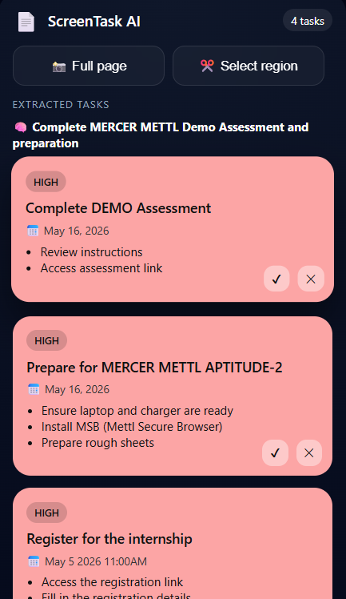

# ScreenTask AI

> AI-powered system that converts unstructured visual input into structured, actionable workflows using multimodal LLM reasoning.

ScreenTask AI is a Chrome Extension + deployed backend that captures screenshots from any webpage and transforms them into structured tasks — with intent, step-by-step execution, priority, and deadlines.

---

## Problem It Solves

Most information on the web is unstructured — emails, dashboards, portals — requiring users to manually interpret and convert it into tasks.

ScreenTask AI eliminates this by:

- Automatically understanding user intent from visual content
- Converting unstructured data into structured workflows
- Reducing manual effort and cognitive load

---

## Why This Matters

This system shifts AI usage from passive extraction to active workflow generation, making it directly usable for real-world productivity tasks.

---

## What Makes This Different

Most tools extract text. ScreenTask AI performs intent-aware task generation.

**Before (simple extraction):**

```
Task: "Complete assessment"
```

**After (intent-aware decomposition):**

```
Intent:   Complete MERCER METTL assessment and preparation
Steps:    1. Register on the provided link
          2. Complete profile before the deadline
          3. Attempt the assessment quiz by April 14th
Priority: HIGH  |  Deadline: April 14, 2026
```

---

## Features

- Capture full page or drag-select a custom region
- Intent-aware extraction using multimodal LLM reasoning
- Converts extracted tasks into step-by-step executable workflows
- Automatic priority detection based on urgency and deadlines
- Full task management — complete, undo, delete
- Popup syncs live from deployed backend (no localhost needed)
- Works on any web content — portals, emails, dashboards, PDFs

---

## Tech Stack

| Layer | Technology |
|---|---|
| Frontend | Chrome Extension — Manifest V3, HTML, CSS, Vanilla JS |
| Backend | Node.js, Express.js |
| Database | MongoDB Atlas + Mongoose |
| AI / Vision | Groq API — LLaMA 4 Scout 17B (multimodal) |
| Deployment | Render (backend), MongoDB Atlas (DB) |

---

## System Architecture

```
Browser Tab
    ↓  captureVisibleTab (full page) OR region drag-select via content.js overlay
Chrome Extension
    ↓  POST /process-screenshot — base64 image
Node.js Backend (Render)
    ↓  Groq Multimodal API — OCR + intent extraction + task decomposition + prioritization
Structured JSON
    ↓  { title, intent, steps[], priority, deadline }
MongoDB Atlas
    ↓  persisted task documents
Extension Popup
    ↓  fetch from deployed API → display → complete / delete
```

---

## Deployment & Usage

The backend is fully deployed on Render:

```
https://screentask-ai.onrender.com
```

The Chrome extension communicates directly with the deployed API, allowing the system to work without any local setup. Install the extension and start extracting tasks from any webpage.

---

## AI Pipeline

A single Groq API call handles everything:

1. **OCR** — reads all text from the screenshot
2. **Intent extraction** — understands the user's goal from context
3. **Task decomposition** — breaks intent into concrete executable steps
4. **Priority scoring** — high / medium / low based on deadlines and urgency keywords
5. **Deadline parsing** — extracts dates from unstructured visual content

Prompt engineering includes strict output rules, deduplication logic, anti-generic instructions, and structured JSON enforcement.

---

## Setup & Installation

### 1. Clone the repository

```bash
git clone https://github.com/Rupal0912/ScreenTask-AI.git
cd ScreenTask-AI
```

### 2. Backend setup (local)

```bash
cd backend
npm install
```

Create a `.env` file inside `backend/`:

```
MONGODB_URI=your_mongodb_connection_string
GROQ_API_KEY=your_groq_api_key
```

```bash
node server.js
```

> **Or skip this entirely** — the deployed backend is already live at `https://screentask-ai.onrender.com`

### 3. Load the Chrome Extension

1. Open Chrome → `chrome://extensions/`
2. Enable **Developer Mode**
3. Click **Load unpacked**
4. Select the `extension/` folder

The ScreenTask AI icon will appear in your Chrome toolbar.

---

## Demo



---

## API Routes

| Method | Route | Description |
|---|---|---|
| `POST` | `/process-screenshot` | Receive image → Groq AI → extract tasks → save to DB |
| `GET` | `/tasks` | Fetch all saved tasks |
| `PATCH` | `/task/:id` | Mark complete / undo |
| `DELETE` | `/task/:id` | Delete a task |

**Live API:** `https://screentask-ai.onrender.com`

---

## Task Schema

```js
{
  title:     String,    // extracted task title
  intent:    String,    // AI-understood user goal
  steps:     [String],  // step-by-step execution plan
  priority:  String,    // "high" | "medium" | "low"
  deadline:  String,    // parsed from screenshot
  completed: Boolean,
  createdAt: Date
}
```

---

## Key Engineering Highlights

- **Intent-aware AI pipeline** — system understands *what the user needs to do*, not just what text is on screen
- **Step decomposition** — each task comes with an execution plan, turning extraction into actionable workflow generation
- **Groq multimodal in one call** — OCR + intent classification + structured JSON, no separate processing layers
- **Deployed backend** — fully online on Render, no localhost dependency, extension works from anywhere
- **Region selection** — custom overlay injected via `content.js` lets users select specific areas instead of full page
- **Backend-driven state** — popup fetches directly from the deployed API, single source of truth
- **Full CRUD lifecycle** — Create (AI) → Read (fetch) → Update (complete/undo) → Delete

---

## Use Cases

- Extract deadlines and action items from course or exam portals
- Capture job/internship application steps from portals
- Convert email instructions into structured task lists
- Break down hackathon problem statements into execution steps
- Replace manual note-taking from any web content

---

## Known Limitations

- No deduplication — capturing the same page twice creates duplicate tasks
- Render free tier has cold starts (~30 sec delay after inactivity)
- Deadline parsing works best with explicit dates; relative phrases may be inconsistent
- No user authentication — tasks are not user-scoped

---

## Future Improvements

- Smart deduplication based on title + intent similarity
- Relative date parsing ("tomorrow", "next Monday")
- Task grouping by source URL or priority
- Google Calendar / Notion sync
- Multi-tab batch capture
- User authentication and personal task boards

---

## Author

**Rupal** — [GitHub](https://github.com/Rupal0912/Rupal0912)

---

*Built with Node.js · MongoDB · Groq Vision API · Chrome Extension Manifest V3 · Render*
