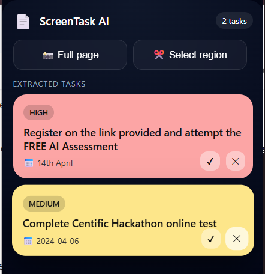

# ScreenTask AI

> Convert any webpage into actionable tasks — powered by AI vision.

A Chrome Extension that captures screenshots of your active browser tab and uses Groq's LLaMA Vision model to extract structured tasks, deadlines, and priorities — automatically saved to MongoDB and displayed in a clean popup UI.

---

## Features

- Capture full page or select a custom region with one click
- AI-powered task extraction from any visual web content
- Automatic priority detection (high / medium / low)
- Deadline parsing from screenshots
- Full task management — complete, undo, delete
- Real-time popup UI synced with backend

---

## Tech Stack

| Layer | Technology |
|---|---|
| Frontend | Chrome Extension — Manifest V3, HTML, CSS, JavaScript |
| Backend | Node.js, Express.js |
| Database | MongoDB Atlas + Mongoose |
| AI / Vision | Groq API — LLaMA 4 Scout (multimodal) |

---

## How It Works

```
Browser Tab
    ↓  chrome.tabs.captureVisibleTab (full) or region drag-select
Chrome Extension
    ↓  POST /process-screenshot (base64 image)
Node.js Backend
    ↓  Groq Vision API — single multimodal call
Structured JSON
    ↓  title, type, priority, deadline
MongoDB Atlas
    ↓  persisted tasks
Extension Popup
    ↓  display, complete, delete
```

---

## Setup & Installation

### 1. Clone the repository

```bash
git clone https://github.com/Rupal0912/ScreenTask-AI.git
cd ScreenTask-AI
```

### 2. Backend setup

```bash
cd backend
npm install
```

Create a `.env` file inside the `backend/` folder:

```
MONGODB_URI=your_mongodb_connection_string
GROQ_API_KEY=your_groq_api_key
```

Start the server:

```bash
node server.js
```

### 3. Load the Chrome Extension

1. Open Chrome and go to `chrome://extensions/`
2. Enable **Developer Mode** (top right toggle)
3. Click **Load unpacked**
4. Select the `extension/` folder

The ScreenTask AI icon will appear in your Chrome toolbar.

---

## Demo



---

## API Routes

| Method | Route | Description |
|---|---|---|
| `POST` | `/process-screenshot` | Receive image, extract tasks via AI, save to DB |
| `GET` | `/tasks` | Fetch all saved tasks |
| `PATCH` | `/task/:id` | Update task (complete / undo) |
| `DELETE` | `/task/:id` | Delete a task |

---

## Key Engineering Highlights

- **Multimodal AI pipeline** — single Groq API call handles both OCR and intent classification, no separate text extraction layer needed
- **Chrome Extension Manifest V3** — uses `captureVisibleTab`, `scripting`, and `storage` APIs with proper host permissions
- **Region selection** — custom overlay injected via `content.js` lets users drag-select specific areas instead of capturing the whole page
- **Full CRUD lifecycle** — tasks flow from screenshot → AI → MongoDB → popup with complete/delete actions
- **Backend-driven state** — popup fetches directly from the API, not from `chrome.storage`, keeping a single source of truth

---

## Known Limitations

- No deduplication — capturing the same page twice will create duplicate tasks
- AI extraction quality depends on screenshot clarity and content structure
- Deadline parsing handles explicit dates well; relative phrases like "next Friday" may be inconsistent
- No user authentication — all tasks are global

---

## Future Improvements

- Smart deduplication based on title similarity
- Improved relative date parsing ("tomorrow", "next Monday")
- Task grouping by source URL or priority
- Google Calendar / Notion integration
- Multi-tab batch capture
- Railway deployment for persistent backend

---

## Use Cases

- Extract assignments and deadlines from course portals
- Capture action items from job or internship portals
- Convert email threads into structured task lists
- Reduce manual note-taking from any web content

---

## Author

**Rupal** — [GitHub](https://github.com/Rupal0912)

---

*Built with Node.js, MongoDB, Groq Vision API, and Chrome Extension APIs.*